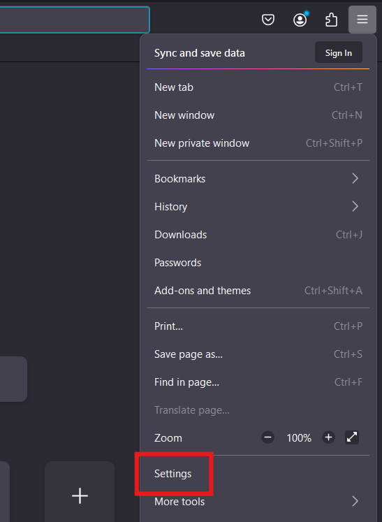
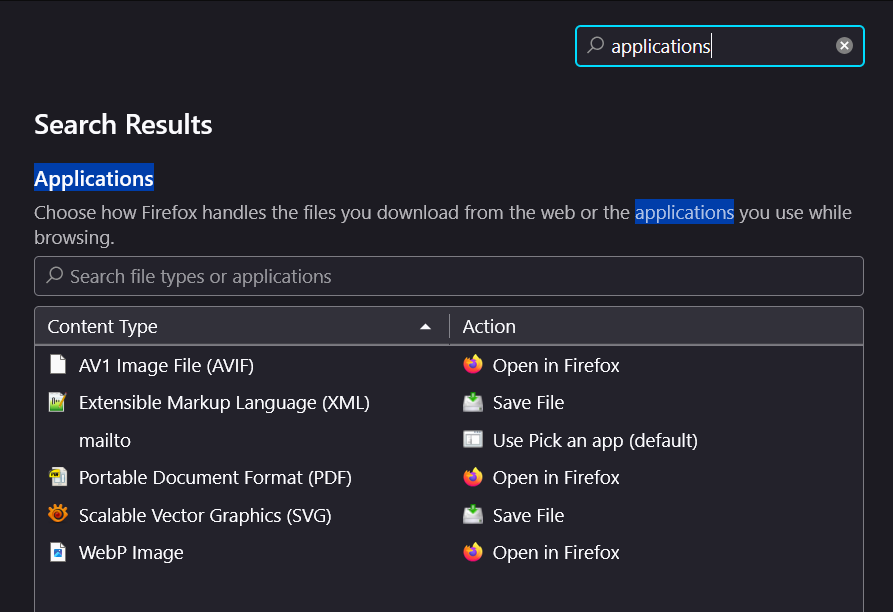
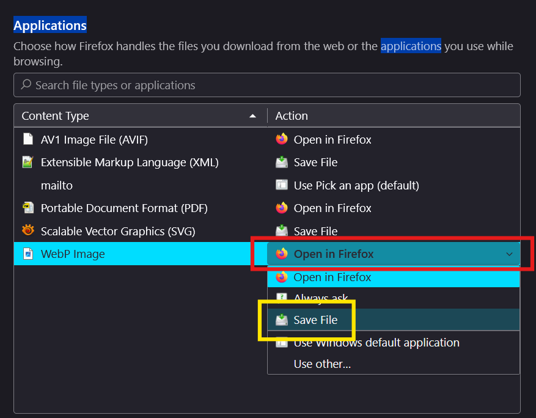

### If you decided to use selenium method, there is additional setup that need to be done on firefox side.

1. Open firefox and go to settings.

2. In the search bar, search for applications. 

3. For the WebP Image, change Action to Save File

Do this for every profiles that you want to use.

[Go back to main tutorial](../README.md)